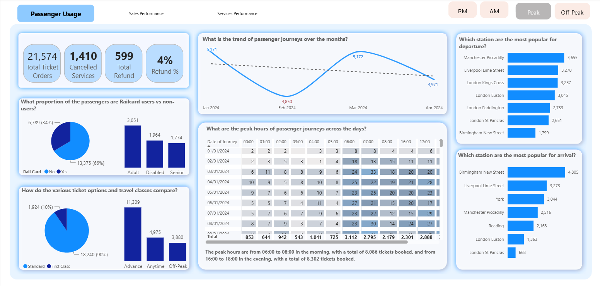
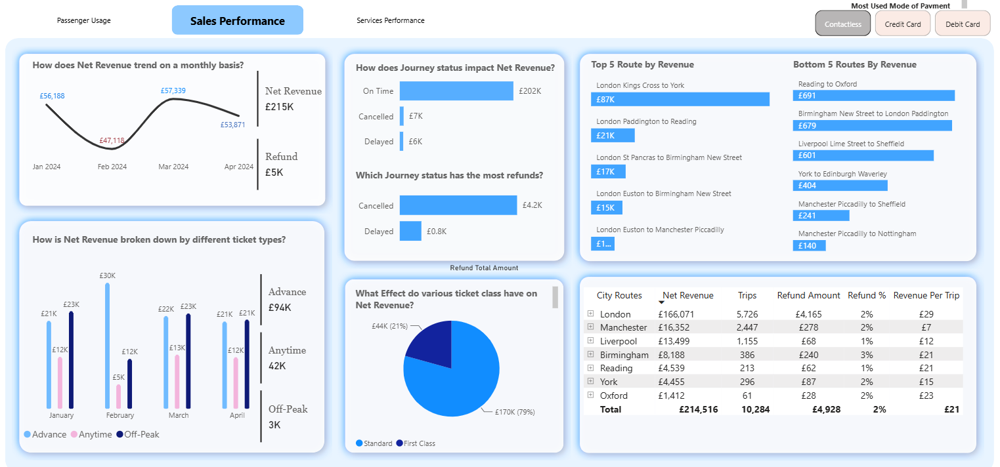
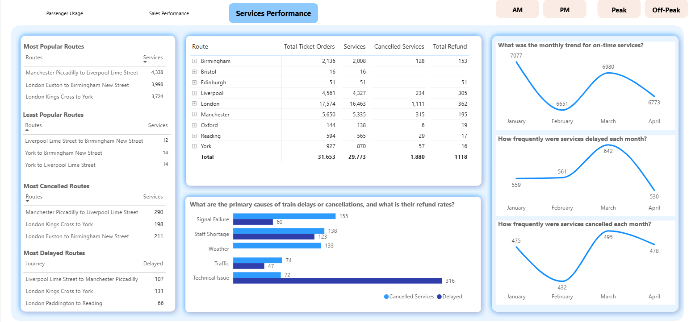
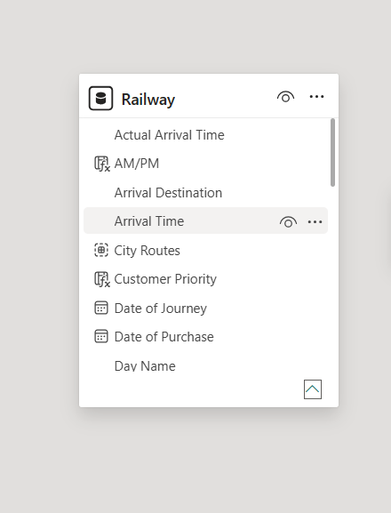
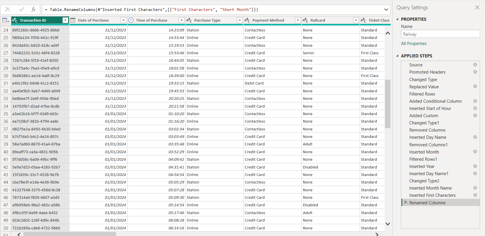

# UK Train Passenger & Sales Performance Dashboard

An interactive Power BI dashboard analysing UK rail passenger usage, sales performance, and service reliability across major routes and stations. Built as a single-table model with DAX-driven KPIs, drill-down route tables, and trend analysis across three report pages.


---

## Overview

This project explores rail ticketing and operational data to answer practical business questions a transport operator's commercial and operations teams would ask:  
**Where is revenue concentrated? Which routes underperform? What's driving delays and cancellations? When do passengers actually travel?**

The dashboard is built as three linked report pages:
- **Passenger Usage** - travel patterns, railcard usage
- **Sales Performance** - revenue, refunds, ticket types, payment methods
- **Services Performance** - delays, cancellations, route reliability
  
Each targets a distinct stakeholder view (commercial, finance, and operations respectively).

---

## Dataset Summary
- **Rows:** 31,653 ticket transactions
- **Source:** Synthetic UK rail ticketing & operational dataset
- **Structure:** - Single denormalised fact table


## Business Questions Answered

**Passenger Usage**
- What is the trend of passenger journeys over time?
- What proportion of passengers are Railcard users vs non-users?
- How do ticket types and travel classes compare?
- What are the peak hours of travel across the week?
- Which stations are most popular for departure and arrival?

**Sales Performance**
- How does net revenue trend month on month?
- How does journey status (on-time, delayed, cancelled) impact revenue and refunds?
- Which ticket types and travel classes generate the most revenue?
- What are the top and bottom performing routes by revenue?
- Which payment method is most used?

**Services Performance**
- Which routes have the highest ticket volumes, cancellations, and refunds?
- What are the primary causes of delays and cancellations, and how do they compare on refund impact?
- How do on-time performance, delays, and cancellations trend monthly?
- Which routes are most/least popular, and most delayed/cancelled?

### **Passenger Usage**



### **Sales Performance**



### **Services Performance**


---

## Key Insights

- Revenue is heavily concentrated: London Kings Cross to York alone generated £87K, more than the next three top routes combined, while the bottom five routes each earned under £700.
- Standard class drives the bulk of revenue (£170K, 79%) vs First Class (£44K, 21%), but Advance tickets (£94K) outperform Anytime (£42K) and Off-Peak combined, suggesting price-sensitive booking behaviour dominates.
- Peak travel is bimodal, concentrated in the 06:00–08:00 morning window (8,086 tickets) and 16:00–18:00 evening window (8,302 tickets), consistent with commuter travel patterns.
- Technical issues are the leading cause of service disruption (316 incidents), more than double the next closest cause (Signal Failure, 155), highlighting an area for further operational investigation.
- Cancellations carry a disproportionate refund cost: cancelled journeys accounted for £4.2K in refunds vs. £0.8K for delays, despite delays being more frequent month to month. This highlights the need to investigate the drivers and financial impact of cancellations.
- London dominates route volume and revenue (£166K net revenue, 5,726 trips) but also carries the highest refund amount (£4,165). This is worth investigating whether this is proportional to volume or a service quality signal.

## Business Recommendations
- **Review high- and low-performing routes:** Investigate what drives the significant revenue differences between routes and assess whether pricing, demand or service frequency explains the variation.
- **Optimise peak-period capacity:** Review capacity and service frequency around the morning and evening peaks to ensure resources align with passenger demand.
- **Investigate technical disruptions:** Analyse recurring technical issues and assess whether preventative maintenance could reduce service disruption.
- **Reduce cancellation-related costs:** Investigate the main causes of cancellations and identify opportunities to reduce cancellations and associated refunds.
- **Monitor London performance:** Assess whether London's higher refund levels are proportional to its substantially higher passenger volume or indicate a service-quality issue.

---

## Data Model

This project uses a **single flat-table model** rather than a star schema. This simplified the model and allowed me to focus on:
- Time based analysis
- Passenger segmentation
- Revenue and refund metrics
- Station level insights
- Ticket type and railcard behaviour
  


---

## DAX Measures (Highlights)

```
Refund % = 
DIVIDE(
       [Refund Total Amount],
       [Total Revenue]
 )
```
```dax
On time % = 
DIVIDE(
      [Ontime Services],
      [Services]
 )
```

```dax
Cancelled % = 
DIVIDE(
       [Cancelled Services],
       [Services]
)
```

```Total Refund = 
CALCULATE(
[Total Ticket Orders],
'Railway'[Refund Request] = "Yes"
)
```
Additional measures built into the model include Net Revenue, Total Refund, Total Ticket Orders, Revenue Per Customer, and Month-on-Month percentage change calculations for cancellations and revenue trends.

---

## Tools Used

Power BI Desktop · Power BI Service (publishing) · DAX · Power Query

---

## Data Transformation (Power Query)

Raw transaction-level data (Transaction ID, Date/Time of Purchase, Purchase Type, Payment Method, Railcard, Ticket Class) was cleaned and shaped in Power Query before modelling. Applied steps included:

- Type conversion and column renaming for clarity
- Conditional columns for ticket and passenger categorisation
- Date/time extraction: Year, Month, Month Name, Day Name, Start of Hour
- Row filtering to remove incomplete or invalid records



---

## Limitations & Next Steps

- Single-table model — a relational (star schema) version is a planned follow-up
- No forecasting applied yet — Power BI's built-in forecasting could be added to the revenue and on-time trend charts
- Route-level analysis could be extended with a geographic map visual for departure/arrival station volumes
